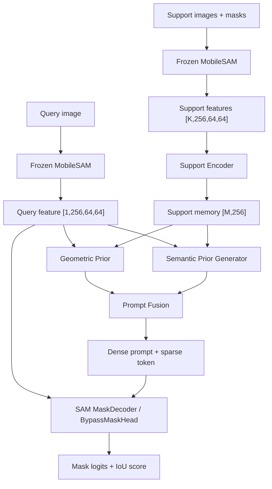
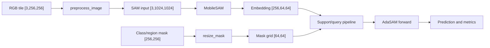
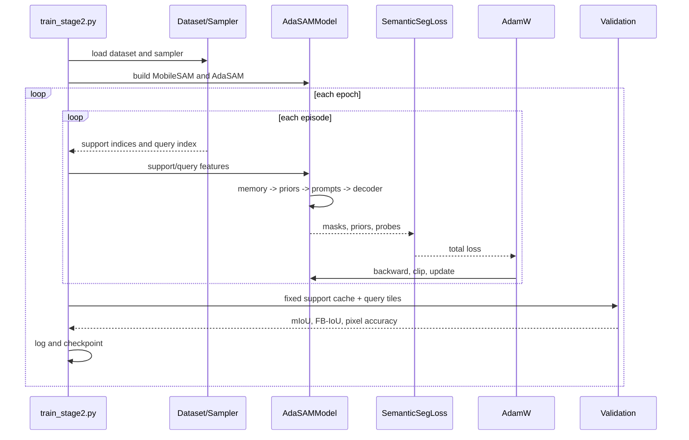
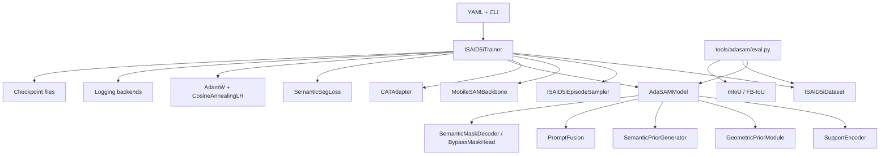
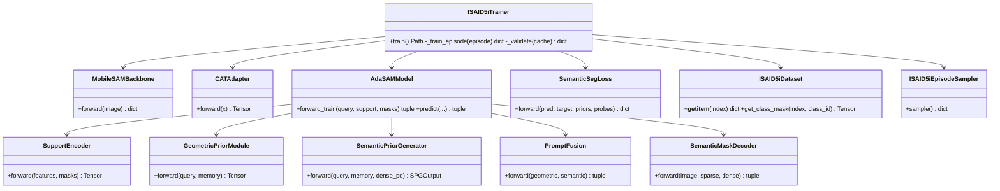

# AdaSAM 技术文档

> **2026-08-10 更新说明：** 当前默认研究入口已经转为
> `adasam.models.LabelEfficientSAM` 与 `tools/train_segmentation.py`、
> `tools/train_loveda.py`、`tools/train_isaid.py`。其结构为冻结 MobileSAM 多尺度特征
> + 可选 CAT 适配 + 多尺度融合/路由 + 轻量语义解码器，并可选 DAPG、DPM、边界分支。
> 本文下方关于 `tools/adasam/train_stage1.py`、`train_stage2.py`、support encoder 和
> SAM MaskDecoder 的说明属于较早的 episode-based few-shot 路线，保留用于追溯，不能
> 当作当前默认训练路径。当前状态总览见 `docs/PROJECT_UPDATE_2026-08-10.md`。

> 本文以当前仓库实际代码为准，覆盖 AdaSAM 主线、Stage 1/Stage 2、iSAID-5i、训练、验证、推理、日志和 checkpoint。本文只描述系统，不修改代码。

## 项目简介

AdaSAM 是基于 MobileSAM 的遥感 few-shot segmentation 研究项目。主线使用冻结的 MobileSAM/TinyViT 提取 query/support 特征，再通过 Support Encoder、Geometric Prior、Semantic Prior Generator 和 Prompt Fusion 生成类别条件 prompt，最后使用 SAM MaskDecoder 或诊断用的 BypassMaskHead 输出 mask。

当前主线更接近按类别预测 binary foreground mask 的 few-shot semantic segmentation。Dataset 保留 region/instance 信息，但 Stage 2 会把同类别区域合并成一个类别前景 mask。

主入口：

- `tools/adasam/train_stage1.py`：训练 CAT Adapter 和 segmentation head。
- `tools/adasam/train_stage2.py`：episode-based few-shot 主训练。
- `tools/adasam/eval.py`：fold、seed、可视化和指标评估。

## 项目目录

```text
adasam/
├── backbone/          MobileSAM/TinyViT 冻结骨干
├── adapters/          CAT-SAM 风格特征适配器
├── support_encoder/   support 特征与 memory token 编码
├── prompt/            几何先验、语义先验、prompt 融合、通道门控
├── decoder/           MobileSAM MaskDecoder 封装
├── model/             AdaSAM 组合模型
├── datasets/          iSAID、iSAID-5i、NEU-Seg、episode sampler
├── losses/            分割损失与先验辅助损失
├── metrics/           mIoU、FB-IoU、pixel accuracy
├── trainer/           旧版通用 Trainer
├── evaluator/         旧版评估器
├── logging/           Console/File/W&B 结构化日志
├── sam_rsp/           SAM-RSP 独立历史分支
└── utils/             预处理、随机种子、debug trace

tools/
├── adasam/            当前 AdaSAM 训练和评估
├── analysis/          实验与诊断脚本
├── debug/             prompt、decoder、梯度诊断
├── neuseg/            NEU-Seg 实验
└── sam_rsp/           SAM-RSP 训练和数据准备

configs/               YAML 配置
tests/                 单元测试和协议审计
thirdparty/MobileSAM/  vendored MobileSAM
weights/               外部模型权重
runs/                  训练输出
```

## 模块介绍

### Backbone

`adasam/backbone/mobile_sam.py` 封装 MobileSAM TinyViT。输入为 `[B,3,1024,1024]`，输出为 `[B,256,64,64]`。骨干始终冻结并保持 `eval()`。

### Adapter

`adasam/adapters/cat_adapter.py` 是 post-encoder residual adapter：

```text
256 -> 64 -> 64 -> 256 + identity
```

最后一层零初始化，初始状态近似恒等映射。

### Support Encoder

`adasam/support_encoder/support_encoder.py` 从 support 前景采样 token，加入空间位置编码，经 support self-attention 和 Memory Bank 压缩为固定数量 memory token。

### Prompt 模块

- `GeometricPriorModule`：由 query 特征和 support memory 产生空间几何先验。
- `SemanticPriorGenerator`：使用 learnable semantic probes，对 query 和 support 做多层 attention，输出语义先验和 prior mask。
- `PromptFusion`：融合 geometric prior 与 semantic prior，生成 dense prompt 和 sparse token。
- `ChannelGate`：可选的通道门控与稀疏正则。

### Decoder

`SemanticMaskDecoder` 将 dense prompt 和单个 sparse token 输入 MobileSAM MaskDecoder。`AdaSAMModel` 还包含 `BypassMaskHead`。当前 `configs/isaid_5i.yaml` 默认 `bypass_decoder: true`，所以默认实验会绕过 SAM MaskDecoder，使用简单卷积头。

## 模型结构



项目没有传统检测器意义上的独立 Neck；`SupportEncoder + GeometricPrior + SPG + PromptFusion` 共同承担条件特征融合和 prompt 生成职责。

## 数据流



## Tensor 尺寸变化

### Query

```text
Dataset image                    [3,256,256]
preprocess + batch               [1,3,1024,1024]
MobileSAM image embedding       [1,256,64,64]
CAT Adapter                     [1,256,64,64]
Geometric Prior                 [1,256,64,64]
Semantic Prior                 [1,256,64,64]
Prior mask                     [1,1,64,64]
Dense prompt                   [1,256,64,64]
Sparse token                   [1,256]
Decoder mask logits            [1,1,256,256]
Decoder IoU prediction         [1,1]
Final mask                     [1,256,256]
```

### Support

默认 `K=5`：

```text
Support images                  [5,3,256,256]
Support features                [5,256,64,64]
Support masks                   [5,64,64]
Sampled tokens                  [5,16,256]
Flattened support tokens        [80,256]
Memory Bank output              [64,256]
```

### Semantic probes

```text
Query spatial memory            [1,4096,256]
Probe tokens                    [16,256]
Probe masks                     [16,64,64]
Probe confidence                [16]
Unified semantic prior          [1,256,64,64]
```

### Loss tensor

```text
Foreground logits               [256,256]
Background logits               [256,256]
Two-class prediction            [1,2,256,256]
GT binary mask                  [1,256,256]
```

## Dataset 说明

主 Dataset 是 `adasam/datasets/isaid_5i.py` 中的 `ISAID5iDataset`，支持 `base`、`novel`、`all` 三种模式。类别 ID 为 `1-15`，背景为 `0`。

单样本契约：

```python
{
    "image": Tensor[3,H,W],
    "regions": [{"category_id": int, "mask": Tensor[H,W]}],
    "image_id": int,
    "image_size": (H,W),
    "tile_id": str,
    "classes": set[int],
    "source_image": str,
}
```

标注通过 8-connectivity 连通分量拆分为 region。Stage 2 再把 query 中同类别 region 合并成一个 binary foreground mask。

`ISAID5iEpisodeSampler` 保证 support 与 query 来自不同 source scene，返回 `class_id`、`support_indices` 和 `query_index`。

当前 AdaSAM 主线没有标准 PyTorch `DataLoader`：Stage 1 手动切索引形成 batch，Stage 2 使用 episode sampler，每次处理 K 个 support 和 1 个 query。 `sam_rsp` 分支有另一套 Dataset/transform 体系。

## Loss 说明

`adasam/losses/semantic_loss.py` 的总体形式：

```text
L = L_main + λprior*L_prior + λreg*L_reg
  + λdiv*L_div + λcov*L_cov + λent*L_ent + λgate*L_gate

L_main = focal_weight*L_focal + dice_weight*L_dice
```

默认：

```yaml
focal_weight: 1.0
dice_weight: 1.0
prior_weight: 0.3
div_weight: 0.0
cov_weight: 0.0
ent_weight: 0.0
```

默认主要优化 `Focal + Dice + Prior deep supervision`。Probe diversity、coverage、entropy 和 channel gate 都是可选项。

## Optimizer 说明

训练使用 `torch.optim.AdamW`。可训练参数主要包括 Support Encoder、SPG、Geometric Prior、Prompt Fusion、BypassMaskHead 或 SAM MaskDecoder，以及可选 CAT Adapter。MobileSAM image encoder 始终冻结。

默认：

```yaml
lr: 1.0e-4
weight_decay: 1.0e-4
grad_clip: 1.0
```

每个 episode 执行 `zero_grad -> backward -> clip_grad_norm_ -> step`。当前没有 AMP、`autocast` 或 `GradScaler`。

## Scheduler 说明

使用：

```python
CosineAnnealingLR(optimizer, T_max=epochs)
```

每个 epoch 调用一次 `scheduler.step()`，不是每个 episode 调用。

## 训练流程



执行顺序：

```text
main()
  -> parse_args()
  -> load_config()
  -> 构建 Dataset / EpisodeSampler / MobileSAM / Model / Loss
  -> trainer.train()
  -> 每个 epoch 训练 N 个 episode
  -> scheduler.step()
  -> validation
  -> 保存 last/best checkpoint
```

## Validation 流程

训练开始时为每个类别建立固定 support cache：

```text
类别 -> K 个 support feature + K 个 support mask grid
```

每次验证固定随机种子抽取验证 tile，对每个可见类别调用 `model.predict()`，统计 per-class IoU、mIoU、FB-IoU 和 pixel accuracy。验证前切换 `model.eval()`，结束后恢复原状态。

## 推理流程

```text
tools/adasam/eval.py
  -> 加载 checkpoint 和 config
  -> 构建 MobileSAM/AdaSAMModel
  -> load_state_dict()
  -> 为每个类别构建 support cache
  -> 读取 query tile
  -> 预处理并提取 query embedding
  -> 逐类别调用 model.predict()
  -> score threshold 过滤
  -> 合并类别 mask
  -> 保存指标、预测 JSON 和可视化
```

`AdaSAMModel.predict()` 使用 `@torch.no_grad()`，调用训练 forward 得到 mask logits，再上采样到原始 tile 尺寸并二值化。

## 日志系统

日志代码位于 `adasam/logging/`，主要组件：

- `Logger`：统一日志入口。
- `ConsoleBackend`：终端输出。
- `FileBackend`：JSONL 文件输出。
- `WandbBackend`：可选 W&B 输出。
- `MetricTracker`：滑动窗口、EMA、均值和标准差。
- `LogContext`：阶段、作用域和 tags 上下文。
- `debug_trace.py`：tensor shape、空间统计和梯度追踪。

典型输出：

```text
runs/<experiment>/train.jsonl
runs/<experiment>/last_metrics.json
runs/<experiment>/val_history.json
runs/<experiment>/aux_viz/
```

## Checkpoint 系统

Stage 2 checkpoint 至少包含：

```python
{
    "epoch": int,
    "stage": "stage2",
    "mode": str,
    "model": state_dict,
    "optimizer": state_dict,
    "config": dict,
    "metrics": dict,
    "fold": int,
    "k_shot": int,
    "visible_classes": list,
    "cat_adapter": optional state_dict,
}
```

- `last_model.pt`：每个 epoch 覆盖保存。
- `best_model.pt`：有验证时按 `val/mIoU`，无验证时按 training loss。
- `last_metrics.json`：最新指标。
- `val_history.json`：训练/验证历史。

## 配置说明

配置优先级：

```text
代码默认值 -> YAML 配置 -> CLI 参数覆盖
```

主配置为 `configs/isaid_5i.yaml`，Stage 1 使用 `configs/stage1.yaml`。常用参数包括：

```yaml
backbone.checkpoint
data.data_root
data.fold
fewshot.k_shot
support_encoder.*
semantic_prior.*
geometric_prior.enabled
prompt_fusion.mode
loss.*
train.epochs
train.episodes_per_epoch
train.lr
train.val_every
eval.score_thr
ablation.bypass_decoder
```

Stage 2 会强制设置 `cfg["fewshot"]["train_mode"] = "base"`。项目没有独立环境变量配置系统，主要依赖 `CUDA_VISIBLE_DEVICES`、PyTorch 环境和相对路径。

## 各模块之间关系



## UML 模块图



## 后续阅读建议

推荐顺序：

1. `configs/isaid_5i.yaml`
2. `tools/adasam/train_stage2.py`
3. `adasam/datasets/isaid_5i.py`
4. `adasam/datasets/episode.py`
5. `adasam/utils/transforms.py`
6. `adasam/backbone/mobile_sam.py`
7. `adasam/support_encoder/support_encoder.py`
8. `adasam/prompt/geometric_prior.py`
9. `adasam/prompt/semantic_prior_generator.py`
10. `adasam/prompt/prompt_fusion.py`
11. `adasam/model/adasam_model.py`
12. `adasam/losses/semantic_loss.py`
13. `tools/adasam/eval.py`
14. `tests/test_model_forward.py`
15. `tests/test_protocol_audit.py`

## 项目评分

| 维度 | 评分 | 评价 |
|---|---:|---|
| 可维护性 | 6.5/10 | 模块拆分和 docstring 较好，但新旧 Trainer、Dataset 和实验分支并存。 |
| 扩展性 | 7.0/10 | prompt、loss、decoder 和 ablation 有配置入口；batch size=1 限制扩展。 |
| 代码规范 | 6.5/10 | 类型标注、dataclass、测试和日志较好；入口和文档存在历史不一致。 |
| 性能 | 5.5/10 | 冻结骨干方向正确；但 support 重复编码、FP32、无 DataLoader 影响吞吐。 |
| 复杂度 | 5.0/10 | SPG、memory 和多种 ablation 功能强，但调试和认知成本高。 |
| **综合** | **6.1/10** | 研究原型质量较好，尚未达到统一、稳定的生产工程水平。 |

优先确认的问题：

1. 是否有意默认启用 `bypass_decoder`。
2. 标注文件是否确实为单通道类别图。
3. 项目最终目标是 semantic segmentation 还是 instance segmentation。
4. 是否需要 feature cache、DataLoader、多 worker 和 AMP。
